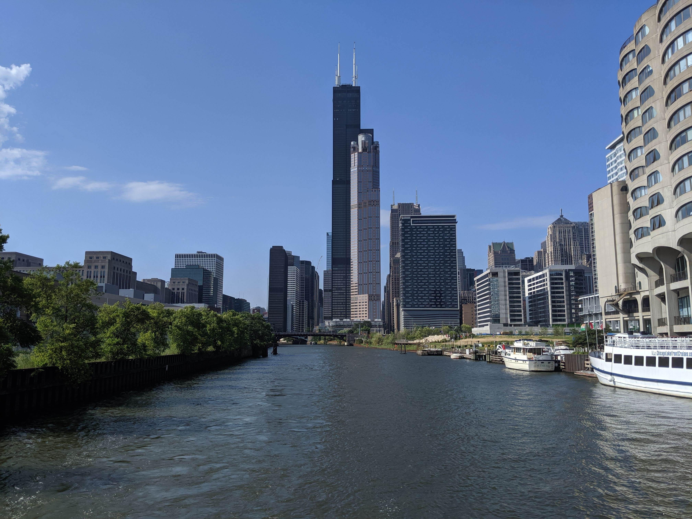
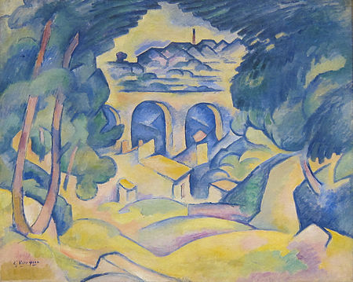
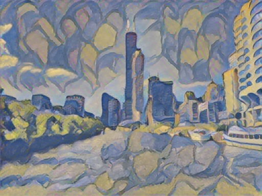

# Curvy blue chicago

This style is based on an artwork of Georges Braques, Le viaduc de l'estaque.

This was found on [wikipedia commons](https://en.wikipedia.org/wiki/The_Viaduct_at_L%27Estaque).

## Original image

## Style : Houses of parliament by Monet

## Result : Curvy Blue Chicago

