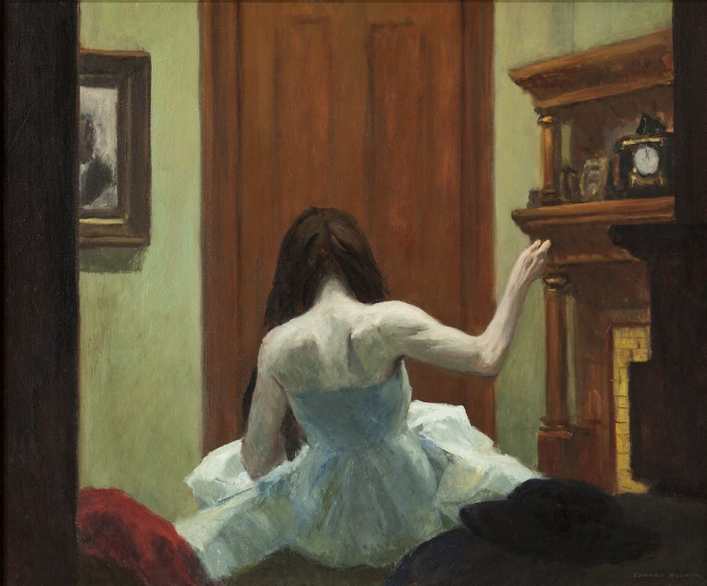
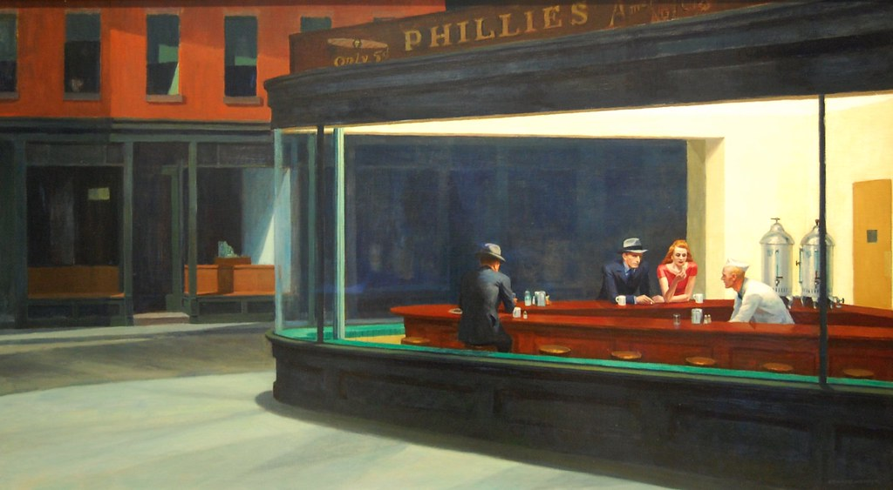
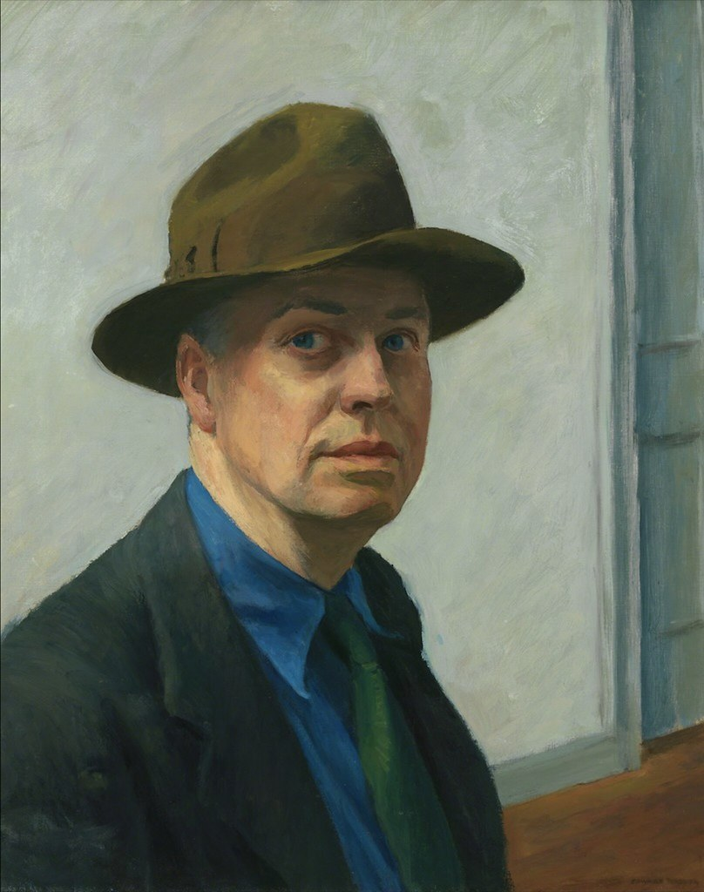
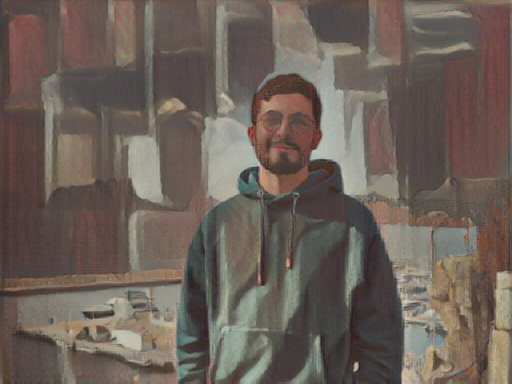
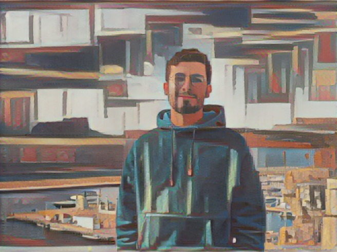
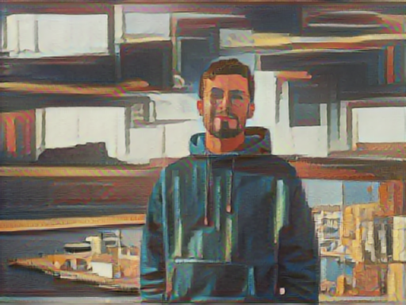

# Maxence Raballand Long Distance

This style is based on artworks from Edward Hopper :

- New York Interior, 1921
- NightHawks, 1942.
- Self-Portrait, 1925-1930.

This was found on [flickr](https://www.flickr.com/photos/gandalfsgallery/48096463632), [flickr](https://www.flickr.com/photos/ugardener/5963766721), and [flickr](https://www.flickr.com/photos/gandalfsgallery/41534099132).

## Original image

## Styles

### New York Interior by Edward Hopper

### NightHawks by Edward Hopper

### Self Poortrait by Edward Hopper

## Results : Poitiers by Monet

