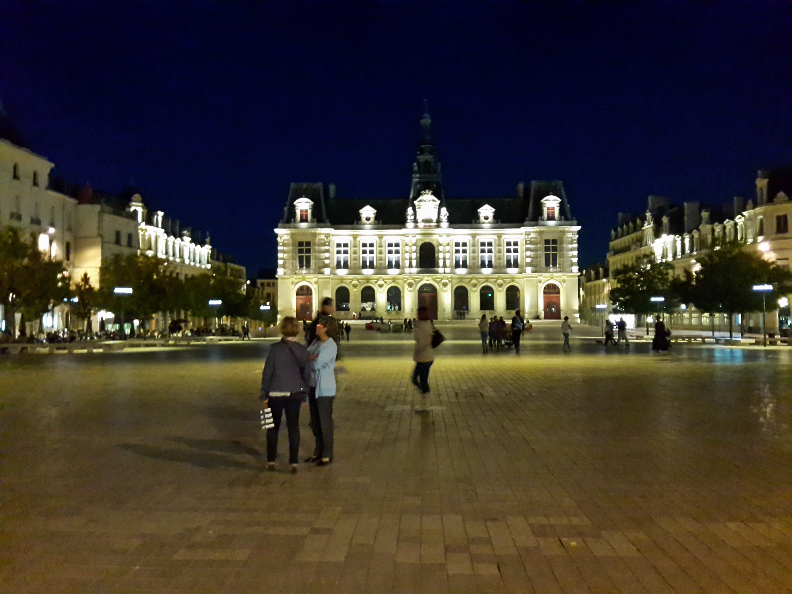

# Poitiers by Monet

This style is based on an artwork of Claude Monet, The London Houses of Parliament.

This was found on [wikipedia commons](https://commons.wikimedia.org/wiki/File:Claude_Monet,_Houses_of_Parliament,_London,_1900-1903,_1933.1164,_Art_Institute_of_Chicago.jpg).

## Original image

## Style : Houses of parliament by Monet

## Result : Poitiers by Monet

