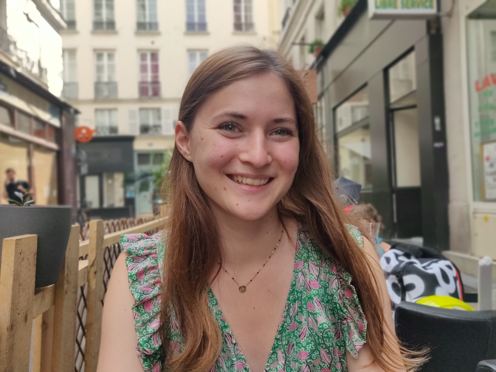
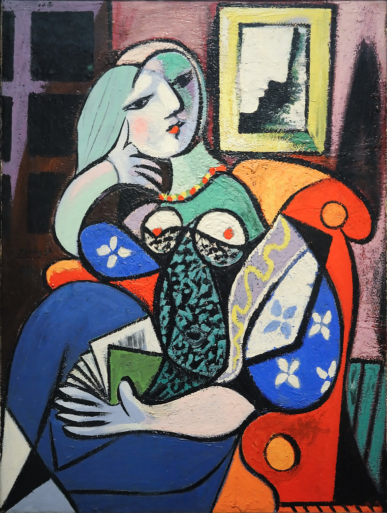
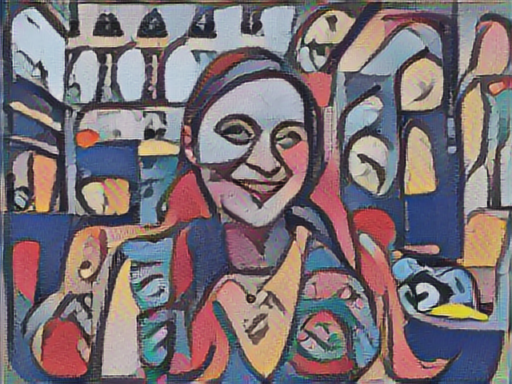

# Portrait of Lea

This style is based on "A woman with a book" by Pablo Picasso.

Doing a portrait with style transfer is pretty difficult. For that, abstract paintings, such as those from Picasso, makes it easier.

This was found on [flickr](https://www.flickr.com/photos/mark6mauno/3128500797).

## Original image

## Style : "A woman with a book" by Pablo Picasso

## Result : Portrait of Lea

